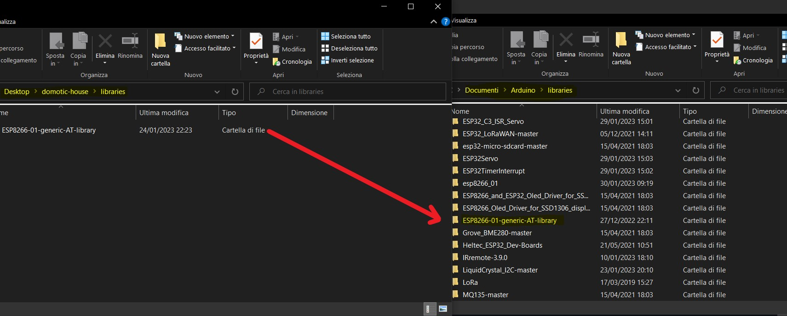

# domotic-house
Project for embedded system

## Section links
- [Pinout](#pinout)
- [Requirements](#requirements)
  - [Hardware requirements](#hardware-requirements)
  - [Software requirements](#software-requirements)
- [Project structure](#project-structure)
- [Getting started](#getting-started)
## Pinout

<table>
<tr><th colspan=2> ESP32 </th></tr>
<tr><th>Pin left </th><th>Pin right</th></tr>
<tr><td>

| pin  | description
| --- | --- 
|GND | 
|5V  |
|Vext  |
|Vext  |
|Rx  |
|Tx  | 
|Rst  |
|0  |LedKitchen
|22  |SCL
|19 |ButTMinus
|23  | Wifi Module RX
|18  | 
|5  |ButGate
|15  |
|2 |SensProximity
|4    | SensProximity
|17  | Wifi Module TX
|16 |ServoMot

</td><td>

| pin  | description
| --- | --- 
|GND |
|3V3|
|3V3|
|36 |
|37 |ButTMode
|38 |ButTOn/Off
|39 |
|34 |ButTPlus
|35 |ButOutdoor	
|32| ButStudio
|33 |ButBedroom
|25 |ButBathroom
|26| ButKitchen
|27 |LedOutdoor
|14 |LedStudio
|12| LedBedroom
|13 |LedBathroom
|21 |SDA

</td></tr> </table>

## Requirements
### Hardware requirements
- Heltec Lora 32 V2
- ESP8266 - 01 wifi module
- TI BOOSTXL-SENSORS BoosterPack (temperature and light sensor are used)
- Ultrasonic sensor HCSR04 
- Continuous rotation servo motor
- LCD alphanumeric 16 x 2 with i2c pilot module
- 10 pushbuttons
- 10 x  5.5 kOhm resistor for pushbuttons
- 7 leds
- 5 breadboards
- Android device
### Software requirements
1. Android Studio IDE
   - Volley library (request from website)
2. Arduino IDE
   - [ESP8266 - 01 library](libraries/ESP8266-01-generic-AT-library) library (pilot ESP8266 with AT commands)
   - Servo.h library
   - Wire.h library (i2c protocol)
   - [LiquidCrystal_I2C.h](https://github.com/johnrickman/LiquidCrystal_I2C) library
   - [Adafruit_TMP006.h](https://github.com/adafruit/Adafruit_TMP006)

## Project structure
``` bash
Domotic_House_Project_IoT_TinyML
   |-- examples
   |   |-- esp32
   |   |   |-- esp32_camera
   |   |   |   |-- esp32_camera.ino
   |   |   |-- esp32_fusion
   |   |   |   |-- esp32_fusion.ino
   |   |   |-- esp32_microphone
   |   |   |   |-- esp32_microphone.ino
   |   |   |-- esp32_microphone_continuous
   |   |   |   |-- esp32_microphone_continuous.ino
   |   |-- nano_ble33_sense
   |   |   |-- nano_ble33_sense_accelerometer
   |   |   |   |-- nano_ble33_sense_accelerometer.ino
   |   |   |-- nano_ble33_sense_accelerometer_continuous
   |   |   |   |-- nano_ble33_sense_accelerometer_continuous.ino
   |   |   |-- nano_ble33_sense_camera
   |   |   |   |-- nano_ble33_sense_camera.ino
   |   |   |-- nano_ble33_sense_fusion
   |   |   |   |-- nano_ble33_sense_fusion.ino
   |   |   |-- nano_ble33_sense_microphone
   |   |   |   |-- nano_ble33_sense_microphone.ino
   |   |   |-- nano_ble33_sense_microphone_continuous
   |   |   |   |-- nano_ble33_sense_microphone_continuous.ino
   |   |-- nicla_sense
   |   |   |-- nicla_sense_fusion
   |   |   |   |-- nicla_sense_fusion.ino
   |   |-- nicla_vision
   |   |   |-- nicla_vision_camera
   |   |   |   |-- nicla_vision_camera.ino
   |   |   |-- nicla_vision_fusion
   |   |   |   |-- nicla_vision_fusion.ino
   |   |   |-- nicla_vision_microphone
   |   |   |   |-- nicla_vision_microphone.ino
   |   |   |-- nicla_vision_microphone_continuous
   |   |   |   |-- nicla_vision_microphone_continuous.ino
   |   |-- portenta_h7
   |   |   |-- portenta_h7_camera
   |   |   |   |-- portenta_h7_camera.ino
   |   |   |-- portenta_h7_microphone
   |   |   |   |-- portenta_h7_microphone.ino
   |   |   |-- portenta_h7_microphone_continuous
   |   |   |   |-- portenta_h7_microphone_continuous.ino
   |   |-- rp2040
   |   |   |-- rp2040_fusion
   |   |   |   |-- rp2040_fusion.ino
   |   |   |-- rp2040_microphone
   |   |   |   |-- rp2040_microphone.ino
   |   |   |-- rp2040_microphone_continuous
   |   |   |   |-- rp2040_microphone_continuous.ino
   |   |-- static_buffer
   |   |   |-- static_buffer
   |   |   |   |-- static_buffer.ino
   |-- library.properties
   |-- src
   |   |-- Domotic_House_Project_IoT_inferencing.h
   |   |-- edge-impulse-sdk
   |   |   |-- .gitignore
   |   |   |-- .mbedignore
   |   |   |-- CMSIS
   |   |   |   |-- Core
   |   |   |   |   |-- Include
   |   |   |   |   |   |-- cachel1_armv7.h
   |   |   |   |   |   |-- cmsis_armcc.h
   |   |   |   |   |   |-- cmsis_armclang.h
   |   |   |   |   |   |-- cmsis_armclang_ltm.h
   |   |   |   |   |   |-- cmsis_compiler.h
   |   |   |   |   |   |-- cmsis_gcc.h
   |   |   |   |   |   |-- cmsis_iccarm.h
   |   |   |   |   |   |-- cmsis_version.h
   |   |   |   |   |   |-- core_armv81mml.h
   |   |   |   |   |   |-- core_armv8mbl.h
   |   |   |   |   |   |-- core_armv8mml.h
   |   |   |   |   |   |-- core_cm0.h
   |   |   |   |   |   |-- core_cm0plus.h
   |   |   |   |   |   |-- core_cm1.h
   |   |   |   |   |   |-- core_cm23.h
   |   |   |   |   |   |-- core_cm3.h
   |   |   |   |   |   |-- core_cm33.h
   |   |   |   |   |   |-- core_cm35p.h
   |   |   |   |   |   |-- core_cm4.h
   |   |   |   |   |   |-- core_cm55.h
   |   |   |   |   |   |-- core_cm7.h
   |   |   |   |   |   |-- core_sc000.h
   |   |   |   |   |   |-- core_sc300.h
   |   |   |   |   |   |-- mpu_armv7.h
   |   |   |   |   |   |-- mpu_armv8.h
   |   |   |   |   |   |-- pmu_armv8.h
   |   |   |   |   |   |-- tz_context.h
   |   |   |   |-- DSP
   |   |   |   |   |-- Include
   |   |   |   |   |   |-- arm_common_tables.h
   |   |   |   |   |   |-- arm_common_tables_f16.h
   |   |   |   |   |   |-- arm_const_structs.h
   |   |   |   |   |   |-- arm_const_structs_f16.h
   |   |   |   |   |   |-- arm_helium_utils.h
   |   |   |   |   |   |-- arm_math.h
   |   |   |   |   |   |-- arm_math_f16.h
   |   |   |   |   |   |-- arm_math_memory.h
   |   |   |   |   |   |-- arm_math_types.h
   |   |   |   |   |   |-- arm_math_types_f16.h
   |   |   |   |   |   |-- arm_mve_tables.h
   |   |   |   |   |   |-- arm_mve_tables_f16.h
   |   |   |   |   |   |-- arm_sorting.h
   |   |   |   |   |   |-- arm_vec_fft.h
   |   |   |   |   |   |-- arm_vec_filtering.h
   |   |   |   |   |   |-- arm_vec_math.h
   |   |   |   |   |   |-- arm_vec_math_f16.h
   |   |   |   |   |   |-- dsp
   |   |   |   |   |   |   |-- basic_math_functions.h
   |   |   |   |   |   |   |-- basic_math_functions_f16.h
   |   |   |   |   |   |   |-- bayes_functions.h
   |   |   |   |   |   |   |-- bayes_functions_f16.h
   |   |   |   |   |   |   |-- complex_math_functions.h
   |   |   |   |   |   |   |-- complex_math_functions_f16.h
   |   |   |   |   |   |   |-- controller_functions.h
   |   |   |   |   |   |   |-- controller_functions_f16.h
   |   |   |   |   |   |   |-- distance_functions.h
   |   |   |   |   |   |   |-- distance_functions_f16.h
   |   |   |   |   |   |   |-- fast_math_functions.h
   |   |   |   |   |   |   |-- fast_math_functions_f16.h
   |   |   |   |   |   |   |-- filtering_functions.h
   |   |   |   |   |   |   |-- filtering_functions_f16.h
   |   |   |   |   |   |   |-- interpolation_functions.h
   |   |   |   |   |   |   |-- interpolation_functions_f16.h
   |   |   |   |   |   |   |-- matrix_functions.h
   |   |   |   |   |   |   |-- matrix_functions_f16.h
   |   |   |   |   |   |   |-- none.h
   |   |   |   |   |   |   |-- quaternion_math_functions.h
   |   |   |   |   |   |   |-- statistics_functions.h
   |   |   |   |   |   |   |-- statistics_functions_f16.h
   |   |   |   |   |   |   |-- support_functions.h
   |   |   |   |   |   |   |-- support_functions_f16.h
   |   |   |   |   |   |   |-- svm_defines.h
   |   |   |   |   |   |   |-- svm_functions.h
   |   |   |   |   |   |   |-- svm_functions_f16.h
   |   |   |   |   |   |   |-- transform_functions.h
   |   |   |   |   |   |   |-- transform_functions_f16.h
   |   |   |   |   |   |   |-- utils.h
   |   |   |   |   |-- PrivateInclude
   |   |   |   |   |   |-- README.md
   |   |   |   |   |-- Source
   |   |   |   |   |   |-- BasicMathFunctions
   |   |   |   |   |   |   |-- arm_abs_f16.c
   |   |   |   |   |   |   |-- arm_abs_f32.c
   |   |   |   |   |   |   |-- arm_abs_q15.c
   |   |   |   |   |   |   |-- arm_abs_q31.c
   |   |   |   |   |   |   |-- arm_abs_q7.c
   |   |   |   |   |   |   |-- arm_add_f16.c
   |   |   |   |   |   |   |-- arm_add_f32.c
   |   |   |   |   |   |   |-- arm_add_q15.c
   |   |   |   |   |   |   |-- arm_add_q31.c
   |   |   |   |   |   |   |-- arm_add_q7.c
   |   |   |   |   |   |   |-- arm_and_u16.c
   |   |   |   |   |   |   |-- arm_and_u32.c
   |   |   |   |   |   |   |-- arm_and_u8.c
   |   |   |   |   |   |   |-- arm_clip_f16.c
   |   |   |   |   |   |   |-- arm_clip_f32.c
   |   |   |   |   |   |   |-- arm_clip_q15.c
   |   |   |   |   |   |   |-- arm_clip_q31.c
   |   |   |   |   |   |   |-- arm_clip_q7.c
   |   |   |   |   |   |   |-- arm_dot_prod_f16.c
   |   |   |   |   |   |   |-- arm_dot_prod_f32.c
   |   |   |   |   |   |   |-- arm_dot_prod_q15.c
   |   |   |   |   |   |   |-- arm_dot_prod_q31.c
   |   |   |   |   |   |   |-- arm_dot_prod_q7.c
   |   |   |   |   |   |   |-- arm_mult_f16.c
   |   |   |   |   |   |   |-- arm_mult_f32.c
   |   |   |   |   |   |   |-- arm_mult_q15.c
   |   |   |   |   |   |   |-- arm_mult_q31.c
   |   |   |   |   |   |   |-- arm_mult_q7.c
   |   |   |   |   |   |   |-- arm_negate_f16.c
   |   |   |   |   |   |   |-- arm_negate_f32.c
   |   |   |   |   |   |   |-- arm_negate_q15.c
   |   |   |   |   |   |   |-- arm_negate_q31.c
   |   |   |   |   |   |   |-- arm_negate_q7.c
   |   |   |   |   |   |   |-- arm_not_u16.c
   |   |   |   |   |   |   |-- arm_not_u32.c
   |   |   |   |   |   |   |-- arm_not_u8.c
   |   |   |   |   |   |   |-- arm_offset_f16.c
   |   |   |   |   |   |   |-- arm_offset_f32.c
   |   |   |   |   |   |   |-- arm_offset_q15.c
   |   |   |   |   |   |   |-- arm_offset_q31.c
   |   |   |   |   |   |   |-- arm_offset_q7.c
   |   |   |   |   |   |   |-- arm_or_u16.c
   |   |   |   |   |   |   |-- arm_or_u32.c
   |   |   |   |   |   |   |-- arm_or_u8.c
   |   |   |   |   |   |   |-- arm_scale_f16.c
   |   |   |   |   |   |   |-- arm_scale_f32.c
   |   |   |   |   |   |   |-- arm_scale_q15.c
   |   |   |   |   |   |   |-- arm_scale_q31.c
   |   |   |   |   |   |   |-- arm_scale_q7.c
   |   |   |   |   |   |   |-- arm_shift_q15.c
   |   |   |   |   |   |   |-- arm_shift_q31.c
   |   |   |   |   |   |   |-- arm_shift_q7.c
   |   |   |   |   |   |   |-- arm_sub_f16.c
   |   |   |   |   |   |   |-- arm_sub_f32.c
   |   |   |   |   |   |   |-- arm_sub_q15.c
   |   |   |   |   |   |   |-- arm_sub_q31.c
   |   |   |   |   |   |   |-- arm_sub_q7.c
   |   |   |   |   |   |   |-- arm_xor_u16.c
   |   |   |   |   |   |   |-- arm_xor_u32.c
   |   |   |   |   |   |   |-- arm_xor_u8.c
   |   |   |   |   |   |-- BayesFunctions
   |   |   |   |   |   |   |-- arm_gaussian_naive_bayes_predict_f16.c
   |   |   |   |   |   |   |-- arm_gaussian_naive_bayes_predict_f32.c
   |   |   |   |   |   |-- CommonTables
   |   |   |   |   |   |   |-- arm_common_tables.c
   |   |   |   |   |   |   |-- arm_common_tables_f16.c
   |   |   |   |   |   |   |-- arm_const_structs.c
   |   |   |   |   |   |   |-- arm_const_structs_f16.c
   |   |   |   |   |   |   |-- arm_mve_tables.c
   |   |   |   |   |   |   |-- arm_mve_tables_f16.c
   |   |   |   |   |   |-- ComplexMathFunctions
   |   |   |   |   |   |   |-- arm_cmplx_conj_f16.c
   |   |   |   |   |   |   |-- arm_cmplx_conj_f32.c
   |   |   |   |   |   |   |-- arm_cmplx_conj_q15.c
   |   |   |   |   |   |   |-- arm_cmplx_conj_q31.c
   |   |   |   |   |   |   |-- arm_cmplx_dot_prod_f16.c
   |   |   |   |   |   |   |-- arm_cmplx_dot_prod_f32.c
   |   |   |   |   |   |   |-- arm_cmplx_dot_prod_q15.c
   |   |   |   |   |   |   |-- arm_cmplx_dot_prod_q31.c
   |   |   |   |   |   |   |-- arm_cmplx_mag_f16.c
   |   |   |   |   |   |   |-- arm_cmplx_mag_f32.c
   |   |   |   |   |   |   |-- arm_cmplx_mag_q15.c
   |   |   |   |   |   |   |-- arm_cmplx_mag_q31.c
   |   |   |   |   |   |   |-- arm_cmplx_mag_squared_f16.c
   |   |   |   |   |   |   |-- arm_cmplx_mag_squared_f32.c
   |   |   |   |   |   |   |-- arm_cmplx_mag_squared_q15.c
   |   |   |   |   |   |   |-- arm_cmplx_mag_squared_q31.c
   |   |   |   |   |   |   |-- arm_cmplx_mult_cmplx_f16.c
   |   |   |   |   |   |   |-- arm_cmplx_mult_cmplx_f32.c
   |   |   |   |   |   |   |-- arm_cmplx_mult_cmplx_q15.c
   |   |   |   |   |   |   |-- arm_cmplx_mult_cmplx_q31.c
   |   |   |   |   |   |   |-- arm_cmplx_mult_real_f16.c
   |   |   |   |   |   |   |-- arm_cmplx_mult_real_f32.c
   |   |   |   |   |   |   |-- arm_cmplx_mult_real_q15.c
   |   |   |   |   |   |   |-- arm_cmplx_mult_real_q31.c
   |   |   |   |   |   |-- ControllerFunctions
   |   |   |   |   |   |   |-- arm_pid_init_f32.c
   |   |   |   |   |   |   |-- arm_pid_init_q15.c
   |   |   |   |   |   |   |-- arm_pid_init_q31.c
   |   |   |   |   |   |   |-- arm_pid_reset_f32.c
   |   |   |   |   |   |   |-- arm_pid_reset_q15.c
   |   |   |   |   |   |   |-- arm_pid_reset_q31.c
   |   |   |   |   |   |   |-- arm_sin_cos_f32.c
   |   |   |   |   |   |   |-- arm_sin_cos_q31.c
   |   |   |   |   |   |-- DistanceFunctions
   |   |   |   |   |   |   |-- arm_boolean_distance.c
   |   |   |   |   |   |   |-- arm_boolean_distance_template.h
   |   |   |   |   |   |   |-- arm_braycurtis_distance_f16.c
   |   |   |   |   |   |   |-- arm_braycurtis_distance_f32.c
   |   |   |   |   |   |   |-- arm_canberra_distance_f16.c
   |   |   |   |   |   |   |-- arm_canberra_distance_f32.c
   |   |   |   |   |   |   |-- arm_chebyshev_distance_f16.c
   |   |   |   |   |   |   |-- arm_chebyshev_distance_f32.c
   |   |   |   |   |   |   |-- arm_cityblock_distance_f16.c
   |   |   |   |   |   |   |-- arm_cityblock_distance_f32.c
   |   |   |   |   |   |   |-- arm_correlation_distance_f16.c
   |   |   |   |   |   |   |-- arm_correlation_distance_f32.c
   |   |   |   |   |   |   |-- arm_cosine_distance_f16.c
   |   |   |   |   |   |   |-- arm_cosine_distance_f32.c
   |   |   |   |   |   |   |-- arm_dice_distance.c
   |   |   |   |   |   |   |-- arm_euclidean_distance_f16.c
   |   |   |   |   |   |   |-- arm_euclidean_distance_f32.c
   |   |   |   |   |   |   |-- arm_hamming_distance.c
   |   |   |   |   |   |   |-- arm_jaccard_distance.c
   |   |   |   |   |   |   |-- arm_jensenshannon_distance_f16.c
   |   |   |   |   |   |   |-- arm_jensenshannon_distance_f32.c
   |   |   |   |   |   |   |-- arm_kulsinski_distance.c
   |   |   |   |   |   |   |-- arm_minkowski_distance_f16.c
   |   |   |   |   |   |   |-- arm_minkowski_distance_f32.c
   |   |   |   |   |   |   |-- arm_rogerstanimoto_distance.c
   |   |   |   |   |   |   |-- arm_russellrao_distance.c
   |   |   |   |   |   |   |-- arm_sokalmichener_distance.c
   |   |   |   |   |   |   |-- arm_sokalsneath_distance.c
   |   |   |   |   |   |   |-- arm_yule_distance.c
   |   |   |   |   |   |-- FastMathFunctions
   |   |   |   |   |   |   |-- arm_cos_f32.c
   |   |   |   |   |   |   |-- arm_cos_q15.c
   |   |   |   |   |   |   |-- arm_cos_q31.c
   |   |   |   |   |   |   |-- arm_sin_f32.c
   |   |   |   |   |   |   |-- arm_sin_q15.c
   |   |   |   |   |   |   |-- arm_sin_q31.c
   |   |   |   |   |   |   |-- arm_sqrt_q15.c
   |   |   |   |   |   |   |-- arm_sqrt_q31.c
   |   |   |   |   |   |   |-- arm_vexp_f16.c
   |   |   |   |   |   |   |-- arm_vexp_f32.c
   |   |   |   |   |   |   |-- arm_vinverse_f16.c
   |   |   |   |   |   |   |-- arm_vlog_f16.c
   |   |   |   |   |   |   |-- arm_vlog_f32.c
   |   |   |   |   |   |-- FilteringFunctions
   |   |   |   |   |   |   |-- arm_biquad_cascade_df1_32x64_init_q31.c
   |   |   |   |   |   |   |-- arm_biquad_cascade_df1_32x64_q31.c
   |   |   |   |   |   |   |-- arm_biquad_cascade_df1_f16.c
   |   |   |   |   |   |   |-- arm_biquad_cascade_df1_f32.c
   |   |   |   |   |   |   |-- arm_biquad_cascade_df1_fast_q15.c
   |   |   |   |   |   |   |-- arm_biquad_cascade_df1_fast_q31.c
   |   |   |   |   |   |   |-- arm_biquad_cascade_df1_init_f16.c
   |   |   |   |   |   |   |-- arm_biquad_cascade_df1_init_f32.c
   |   |   |   |   |   |   |-- arm_biquad_cascade_df1_init_q15.c
   |   |   |   |   |   |   |-- arm_biquad_cascade_df1_init_q31.c
   |   |   |   |   |   |   |-- arm_biquad_cascade_df1_q15.c
   |   |   |   |   |   |   |-- arm_biquad_cascade_df1_q31.c
   |   |   |   |   |   |   |-- arm_biquad_cascade_df2T_f16.c
   |   |   |   |   |   |   |-- arm_biquad_cascade_df2T_f32.c
   |   |   |   |   |   |   |-- arm_biquad_cascade_df2T_f64.c
   |   |   |   |   |   |   |-- arm_biquad_cascade_df2T_init_f16.c
   |   |   |   |   |   |   |-- arm_biquad_cascade_df2T_init_f32.c
   |   |   |   |   |   |   |-- arm_biquad_cascade_df2T_init_f64.c
   |   |   |   |   |   |   |-- arm_biquad_cascade_stereo_df2T_f16.c
   |   |   |   |   |   |   |-- arm_biquad_cascade_stereo_df2T_f32.c
   |   |   |   |   |   |   |-- arm_biquad_cascade_stereo_df2T_init_f16.c
   |   |   |   |   |   |   |-- arm_biquad_cascade_stereo_df2T_init_f32.c
   |   |   |   |   |   |   |-- arm_conv_f32.c
   |   |   |   |   |   |   |-- arm_conv_fast_opt_q15.c
   |   |   |   |   |   |   |-- arm_conv_fast_q15.c
   |   |   |   |   |   |   |-- arm_conv_fast_q31.c
   |   |   |   |   |   |   |-- arm_conv_opt_q15.c
   |   |   |   |   |   |   |-- arm_conv_opt_q7.c
   |   |   |   |   |   |   |-- arm_conv_partial_f32.c
   |   |   |   |   |   |   |-- arm_conv_partial_fast_opt_q15.c
   |   |   |   |   |   |   |-- arm_conv_partial_fast_q15.c
   |   |   |   |   |   |   |-- arm_conv_partial_fast_q31.c
   |   |   |   |   |   |   |-- arm_conv_partial_opt_q15.c
   |   |   |   |   |   |   |-- arm_conv_partial_opt_q7.c
   |   |   |   |   |   |   |-- arm_conv_partial_q15.c
   |   |   |   |   |   |   |-- arm_conv_partial_q31.c
   |   |   |   |   |   |   |-- arm_conv_partial_q7.c
   |   |   |   |   |   |   |-- arm_conv_q15.c
   |   |   |   |   |   |   |-- arm_conv_q31.c
   |   |   |   |   |   |   |-- arm_conv_q7.c
   |   |   |   |   |   |   |-- arm_correlate_f16.c
   |   |   |   |   |   |   |-- arm_correlate_f32.c
   |   |   |   |   |   |   |-- arm_correlate_fast_opt_q15.c
   |   |   |   |   |   |   |-- arm_correlate_fast_q15.c
   |   |   |   |   |   |   |-- arm_correlate_fast_q31.c
   |   |   |   |   |   |   |-- arm_correlate_opt_q15.c
   |   |   |   |   |   |   |-- arm_correlate_opt_q7.c
   |   |   |   |   |   |   |-- arm_correlate_q15.c
   |   |   |   |   |   |   |-- arm_correlate_q31.c
   |   |   |   |   |   |   |-- arm_correlate_q7.c
   |   |   |   |   |   |   |-- arm_fir_decimate_f32.c
   |   |   |   |   |   |   |-- arm_fir_decimate_fast_q15.c
   |   |   |   |   |   |   |-- arm_fir_decimate_fast_q31.c
   |   |   |   |   |   |   |-- arm_fir_decimate_init_f32.c
   |   |   |   |   |   |   |-- arm_fir_decimate_init_q15.c
   |   |   |   |   |   |   |-- arm_fir_decimate_init_q31.c
   |   |   |   |   |   |   |-- arm_fir_decimate_q15.c
   |   |   |   |   |   |   |-- arm_fir_decimate_q31.c
   |   |   |   |   |   |   |-- arm_fir_f16.c
   |   |   |   |   |   |   |-- arm_fir_f32.c
   |   |   |   |   |   |   |-- arm_fir_fast_q15.c
   |   |   |   |   |   |   |-- arm_fir_fast_q31.c
   |   |   |   |   |   |   |-- arm_fir_init_f16.c
   |   |   |   |   |   |   |-- arm_fir_init_f32.c
   |   |   |   |   |   |   |-- arm_fir_init_q15.c
   |   |   |   |   |   |   |-- arm_fir_init_q31.c
   |   |   |   |   |   |   |-- arm_fir_init_q7.c
   |   |   |   |   |   |   |-- arm_fir_interpolate_f32.c
   |   |   |   |   |   |   |-- arm_fir_interpolate_init_f32.c
   |   |   |   |   |   |   |-- arm_fir_interpolate_init_q15.c
   |   |   |   |   |   |   |-- arm_fir_interpolate_init_q31.c
   |   |   |   |   |   |   |-- arm_fir_interpolate_q15.c
   |   |   |   |   |   |   |-- arm_fir_interpolate_q31.c
   |   |   |   |   |   |   |-- arm_fir_lattice_f32.c
   |   |   |   |   |   |   |-- arm_fir_lattice_init_f32.c
   |   |   |   |   |   |   |-- arm_fir_lattice_init_q15.c
   |   |   |   |   |   |   |-- arm_fir_lattice_init_q31.c
   |   |   |   |   |   |   |-- arm_fir_lattice_q15.c
   |   |   |   |   |   |   |-- arm_fir_lattice_q31.c
   |   |   |   |   |   |   |-- arm_fir_q15.c
   |   |   |   |   |   |   |-- arm_fir_q31.c
   |   |   |   |   |   |   |-- arm_fir_q7.c
   |   |   |   |   |   |   |-- arm_fir_sparse_f32.c
   |   |   |   |   |   |   |-- arm_fir_sparse_init_f32.c
   |   |   |   |   |   |   |-- arm_fir_sparse_init_q15.c
   |   |   |   |   |   |   |-- arm_fir_sparse_init_q31.c
   |   |   |   |   |   |   |-- arm_fir_sparse_init_q7.c
   |   |   |   |   |   |   |-- arm_fir_sparse_q15.c
   |   |   |   |   |   |   |-- arm_fir_sparse_q31.c
   |   |   |   |   |   |   |-- arm_fir_sparse_q7.c
   |   |   |   |   |   |   |-- arm_iir_lattice_f32.c
   |   |   |   |   |   |   |-- arm_iir_lattice_init_f32.c
   |   |   |   |   |   |   |-- arm_iir_lattice_init_q15.c
   |   |   |   |   |   |   |-- arm_iir_lattice_init_q31.c
   |   |   |   |   |   |   |-- arm_iir_lattice_q15.c
   |   |   |   |   |   |   |-- arm_iir_lattice_q31.c
   |   |   |   |   |   |   |-- arm_lms_f32.c
   |   |   |   |   |   |   |-- arm_lms_init_f32.c
   |   |   |   |   |   |   |-- arm_lms_init_q15.c
   |   |   |   |   |   |   |-- arm_lms_init_q31.c
   |   |   |   |   |   |   |-- arm_lms_norm_f32.c
   |   |   |   |   |   |   |-- arm_lms_norm_init_f32.c
   |   |   |   |   |   |   |-- arm_lms_norm_init_q15.c
   |   |   |   |   |   |   |-- arm_lms_norm_init_q31.c
   |   |   |   |   |   |   |-- arm_lms_norm_q15.c
   |   |   |   |   |   |   |-- arm_lms_norm_q31.c
   |   |   |   |   |   |   |-- arm_lms_q15.c
   |   |   |   |   |   |   |-- arm_lms_q31.c
   |   |   |   |   |   |-- InterpolationFunctions
   |   |   |   |   |   |   |-- arm_bilinear_interp_f16.c
   |   |   |   |   |   |   |-- arm_bilinear_interp_f32.c
   |   |   |   |   |   |   |-- arm_bilinear_interp_q15.c
   |   |   |   |   |   |   |-- arm_bilinear_interp_q31.c
   |   |   |   |   |   |   |-- arm_bilinear_interp_q7.c
   |   |   |   |   |   |   |-- arm_linear_interp_f16.c
   |   |   |   |   |   |   |-- arm_linear_interp_f32.c
   |   |   |   |   |   |   |-- arm_linear_interp_q15.c
   |   |   |   |   |   |   |-- arm_linear_interp_q31.c
   |   |   |   |   |   |   |-- arm_linear_interp_q7.c
   |   |   |   |   |   |   |-- arm_spline_interp_f32.c
   |   |   |   |   |   |   |-- arm_spline_interp_init_f32.c
   |   |   |   |   |   |-- MatrixFunctions
   |   |   |   |   |   |   |-- arm_mat_add_f16.c
   |   |   |   |   |   |   |-- arm_mat_add_f32.c
   |   |   |   |   |   |   |-- arm_mat_add_q15.c
   |   |   |   |   |   |   |-- arm_mat_add_q31.c
   |   |   |   |   |   |   |-- arm_mat_cholesky_f16.c
   |   |   |   |   |   |   |-- arm_mat_cholesky_f32.c
   |   |   |   |   |   |   |-- arm_mat_cholesky_f64.c
   |   |   |   |   |   |   |-- arm_mat_cmplx_mult_f16.c
   |   |   |   |   |   |   |-- arm_mat_cmplx_mult_f32.c
   |   |   |   |   |   |   |-- arm_mat_cmplx_mult_q15.c
   |   |   |   |   |   |   |-- arm_mat_cmplx_mult_q31.c
   |   |   |   |   |   |   |-- arm_mat_cmplx_trans_f16.c
   |   |   |   |   |   |   |-- arm_mat_cmplx_trans_f32.c
   |   |   |   |   |   |   |-- arm_mat_cmplx_trans_q15.c
   |   |   |   |   |   |   |-- arm_mat_cmplx_trans_q31.c
   |   |   |   |   |   |   |-- arm_mat_init_f16.c
   |   |   |   |   |   |   |-- arm_mat_init_f32.c
   |   |   |   |   |   |   |-- arm_mat_init_q15.c
   |   |   |   |   |   |   |-- arm_mat_init_q31.c
   |   |   |   |   |   |   |-- arm_mat_inverse_f16.c
   |   |   |   |   |   |   |-- arm_mat_inverse_f32.c
   |   |   |   |   |   |   |-- arm_mat_inverse_f64.c
   |   |   |   |   |   |   |-- arm_mat_ldlt_f32.c
   |   |   |   |   |   |   |-- arm_mat_ldlt_f64.c
   |   |   |   |   |   |   |-- arm_mat_mult_f16.c
   |   |   |   |   |   |   |-- arm_mat_mult_f32.c
   |   |   |   |   |   |   |-- arm_mat_mult_f64.c
   |   |   |   |   |   |   |-- arm_mat_mult_fast_q15.c
   |   |   |   |   |   |   |-- arm_mat_mult_fast_q31.c
   |   |   |   |   |   |   |-- arm_mat_mult_q15.c
   |   |   |   |   |   |   |-- arm_mat_mult_q31.c
   |   |   |   |   |   |   |-- arm_mat_mult_q7.c
   |   |   |   |   |   |   |-- arm_mat_scale_f16.c
   |   |   |   |   |   |   |-- arm_mat_scale_f32.c
   |   |   |   |   |   |   |-- arm_mat_scale_q15.c
   |   |   |   |   |   |   |-- arm_mat_scale_q31.c
   |   |   |   |   |   |   |-- arm_mat_solve_lower_triangular_f16.c
   |   |   |   |   |   |   |-- arm_mat_solve_lower_triangular_f32.c
   |   |   |   |   |   |   |-- arm_mat_solve_lower_triangular_f64.c
   |   |   |   |   |   |   |-- arm_mat_solve_upper_triangular_f16.c
   |   |   |   |   |   |   |-- arm_mat_solve_upper_triangular_f32.c
   |   |   |   |   |   |   |-- arm_mat_solve_upper_triangular_f64.c
   |   |   |   |   |   |   |-- arm_mat_sub_f16.c
   |   |   |   |   |   |   |-- arm_mat_sub_f32.c
   |   |   |   |   |   |   |-- arm_mat_sub_f64.c
   |   |   |   |   |   |   |-- arm_mat_sub_q15.c
   |   |   |   |   |   |   |-- arm_mat_sub_q31.c
   |   |   |   |   |   |   |-- arm_mat_trans_f16.c
   |   |   |   |   |   |   |-- arm_mat_trans_f32.c
   |   |   |   |   |   |   |-- arm_mat_trans_f64.c
   |   |   |   |   |   |   |-- arm_mat_trans_q15.c
   |   |   |   |   |   |   |-- arm_mat_trans_q31.c
   |   |   |   |   |   |   |-- arm_mat_trans_q7.c
   |   |   |   |   |   |   |-- arm_mat_vec_mult_f16.c
   |   |   |   |   |   |   |-- arm_mat_vec_mult_f32.c
   |   |   |   |   |   |   |-- arm_mat_vec_mult_q15.c
   |   |   |   |   |   |   |-- arm_mat_vec_mult_q31.c
   |   |   |   |   |   |   |-- arm_mat_vec_mult_q7.c
   |   |   |   |   |   |-- QuaternionMathFunctions
   |   |   |   |   |   |   |-- arm_quaternion2rotation_f32.c
   |   |   |   |   |   |   |-- arm_quaternion_conjugate_f32.c
   |   |   |   |   |   |   |-- arm_quaternion_inverse_f32.c
   |   |   |   |   |   |   |-- arm_quaternion_norm_f32.c
   |   |   |   |   |   |   |-- arm_quaternion_normalize_f32.c
   |   |   |   |   |   |   |-- arm_quaternion_product_f32.c
   |   |   |   |   |   |   |-- arm_quaternion_product_single_f32.c
   |   |   |   |   |   |   |-- arm_rotation2quaternion_f32.c
   |   |   |   |   |   |-- SVMFunctions
   |   |   |   |   |   |   |-- arm_svm_linear_init_f16.c
   |   |   |   |   |   |   |-- arm_svm_linear_init_f32.c
   |   |   |   |   |   |   |-- arm_svm_linear_predict_f16.c
   |   |   |   |   |   |   |-- arm_svm_linear_predict_f32.c
   |   |   |   |   |   |   |-- arm_svm_polynomial_init_f16.c
   |   |   |   |   |   |   |-- arm_svm_polynomial_init_f32.c
   |   |   |   |   |   |   |-- arm_svm_polynomial_predict_f16.c
   |   |   |   |   |   |   |-- arm_svm_polynomial_predict_f32.c
   |   |   |   |   |   |   |-- arm_svm_rbf_init_f16.c
   |   |   |   |   |   |   |-- arm_svm_rbf_init_f32.c
   |   |   |   |   |   |   |-- arm_svm_rbf_predict_f16.c
   |   |   |   |   |   |   |-- arm_svm_rbf_predict_f32.c
   |   |   |   |   |   |   |-- arm_svm_sigmoid_init_f16.c
   |   |   |   |   |   |   |-- arm_svm_sigmoid_init_f32.c
   |   |   |   |   |   |   |-- arm_svm_sigmoid_predict_f16.c
   |   |   |   |   |   |   |-- arm_svm_sigmoid_predict_f32.c
   |   |   |   |   |   |-- StatisticsFunctions
   |   |   |   |   |   |   |-- arm_entropy_f16.c
   |   |   |   |   |   |   |-- arm_entropy_f32.c
   |   |   |   |   |   |   |-- arm_entropy_f64.c
   |   |   |   |   |   |   |-- arm_kullback_leibler_f16.c
   |   |   |   |   |   |   |-- arm_kullback_leibler_f32.c
   |   |   |   |   |   |   |-- arm_kullback_leibler_f64.c
   |   |   |   |   |   |   |-- arm_logsumexp_dot_prod_f16.c
   |   |   |   |   |   |   |-- arm_logsumexp_dot_prod_f32.c
   |   |   |   |   |   |   |-- arm_logsumexp_f16.c
   |   |   |   |   |   |   |-- arm_logsumexp_f32.c
   |   |   |   |   |   |   |-- arm_max_f16.c
   |   |   |   |   |   |   |-- arm_max_f32.c
   |   |   |   |   |   |   |-- arm_max_no_idx_f16.c
   |   |   |   |   |   |   |-- arm_max_no_idx_f32.c
   |   |   |   |   |   |   |-- arm_max_q15.c
   |   |   |   |   |   |   |-- arm_max_q31.c
   |   |   |   |   |   |   |-- arm_max_q7.c
   |   |   |   |   |   |   |-- arm_mean_f16.c
   |   |   |   |   |   |   |-- arm_mean_f32.c
   |   |   |   |   |   |   |-- arm_mean_q15.c
   |   |   |   |   |   |   |-- arm_mean_q31.c
   |   |   |   |   |   |   |-- arm_mean_q7.c
   |   |   |   |   |   |   |-- arm_min_f16.c
   |   |   |   |   |   |   |-- arm_min_f32.c
   |   |   |   |   |   |   |-- arm_min_q15.c
   |   |   |   |   |   |   |-- arm_min_q31.c
   |   |   |   |   |   |   |-- arm_min_q7.c
   |   |   |   |   |   |   |-- arm_power_f16.c
   |   |   |   |   |   |   |-- arm_power_f32.c
   |   |   |   |   |   |   |-- arm_power_q15.c
   |   |   |   |   |   |   |-- arm_power_q31.c
   |   |   |   |   |   |   |-- arm_power_q7.c
   |   |   |   |   |   |   |-- arm_rms_f16.c
   |   |   |   |   |   |   |-- arm_rms_f32.c
   |   |   |   |   |   |   |-- arm_rms_q15.c
   |   |   |   |   |   |   |-- arm_rms_q31.c
   |   |   |   |   |   |   |-- arm_std_f16.c
   |   |   |   |   |   |   |-- arm_std_f32.c
   |   |   |   |   |   |   |-- arm_std_q15.c
   |   |   |   |   |   |   |-- arm_std_q31.c
   |   |   |   |   |   |   |-- arm_var_f16.c
   |   |   |   |   |   |   |-- arm_var_f32.c
   |   |   |   |   |   |   |-- arm_var_q15.c
   |   |   |   |   |   |   |-- arm_var_q31.c
   |   |   |   |   |   |-- SupportFunctions
   |   |   |   |   |   |   |-- arm_barycenter_f16.c
   |   |   |   |   |   |   |-- arm_barycenter_f32.c
   |   |   |   |   |   |   |-- arm_bitonic_sort_f32.c
   |   |   |   |   |   |   |-- arm_bubble_sort_f32.c
   |   |   |   |   |   |   |-- arm_copy_f16.c
   |   |   |   |   |   |   |-- arm_copy_f32.c
   |   |   |   |   |   |   |-- arm_copy_q15.c
   |   |   |   |   |   |   |-- arm_copy_q31.c
   |   |   |   |   |   |   |-- arm_copy_q7.c
   |   |   |   |   |   |   |-- arm_f16_to_float.c
   |   |   |   |   |   |   |-- arm_f16_to_q15.c
   |   |   |   |   |   |   |-- arm_fill_f16.c
   |   |   |   |   |   |   |-- arm_fill_f32.c
   |   |   |   |   |   |   |-- arm_fill_q15.c
   |   |   |   |   |   |   |-- arm_fill_q31.c
   |   |   |   |   |   |   |-- arm_fill_q7.c
   |   |   |   |   |   |   |-- arm_float_to_f16.c
   |   |   |   |   |   |   |-- arm_float_to_q15.c
   |   |   |   |   |   |   |-- arm_float_to_q31.c
   |   |   |   |   |   |   |-- arm_float_to_q7.c
   |   |   |   |   |   |   |-- arm_heap_sort_f32.c
   |   |   |   |   |   |   |-- arm_insertion_sort_f32.c
   |   |   |   |   |   |   |-- arm_merge_sort_f32.c
   |   |   |   |   |   |   |-- arm_merge_sort_init_f32.c
   |   |   |   |   |   |   |-- arm_q15_to_f16.c
   |   |   |   |   |   |   |-- arm_q15_to_float.c
   |   |   |   |   |   |   |-- arm_q15_to_q31.c
   |   |   |   |   |   |   |-- arm_q15_to_q7.c
   |   |   |   |   |   |   |-- arm_q31_to_float.c
   |   |   |   |   |   |   |-- arm_q31_to_q15.c
   |   |   |   |   |   |   |-- arm_q31_to_q7.c
   |   |   |   |   |   |   |-- arm_q7_to_float.c
   |   |   |   |   |   |   |-- arm_q7_to_q15.c
   |   |   |   |   |   |   |-- arm_q7_to_q31.c
   |   |   |   |   |   |   |-- arm_quick_sort_f32.c
   |   |   |   |   |   |   |-- arm_selection_sort_f32.c
   |   |   |   |   |   |   |-- arm_sort_f32.c
   |   |   |   |   |   |   |-- arm_sort_init_f32.c
   |   |   |   |   |   |   |-- arm_weighted_sum_f16.c
   |   |   |   |   |   |   |-- arm_weighted_sum_f32.c
   |   |   |   |   |   |-- TransformFunctions
   |   |   |   |   |   |   |-- arm_bitreversal.c
   |   |   |   |   |   |   |-- arm_bitreversal2.c
   |   |   |   |   |   |   |-- arm_bitreversal_f16.c
   |   |   |   |   |   |   |-- arm_cfft_f16.c
   |   |   |   |   |   |   |-- arm_cfft_f32.c
   |   |   |   |   |   |   |-- arm_cfft_f64.c
   |   |   |   |   |   |   |-- arm_cfft_init_f16.c
   |   |   |   |   |   |   |-- arm_cfft_init_f32.c
   |   |   |   |   |   |   |-- arm_cfft_init_f64.c
   |   |   |   |   |   |   |-- arm_cfft_init_q15.c
   |   |   |   |   |   |   |-- arm_cfft_init_q31.c
   |   |   |   |   |   |   |-- arm_cfft_q15.c
   |   |   |   |   |   |   |-- arm_cfft_q31.c
   |   |   |   |   |   |   |-- arm_cfft_radix2_f16.c
   |   |   |   |   |   |   |-- arm_cfft_radix2_f32.c
   |   |   |   |   |   |   |-- arm_cfft_radix2_init_f16.c
   |   |   |   |   |   |   |-- arm_cfft_radix2_init_f32.c
   |   |   |   |   |   |   |-- arm_cfft_radix2_init_q15.c
   |   |   |   |   |   |   |-- arm_cfft_radix2_init_q31.c
   |   |   |   |   |   |   |-- arm_cfft_radix2_q15.c
   |   |   |   |   |   |   |-- arm_cfft_radix2_q31.c
   |   |   |   |   |   |   |-- arm_cfft_radix4_f16.c
   |   |   |   |   |   |   |-- arm_cfft_radix4_f32.c
   |   |   |   |   |   |   |-- arm_cfft_radix4_init_f16.c
   |   |   |   |   |   |   |-- arm_cfft_radix4_init_f32.c
   |   |   |   |   |   |   |-- arm_cfft_radix4_init_q15.c
   |   |   |   |   |   |   |-- arm_cfft_radix4_init_q31.c
   |   |   |   |   |   |   |-- arm_cfft_radix4_q15.c
   |   |   |   |   |   |   |-- arm_cfft_radix4_q31.c
   |   |   |   |   |   |   |-- arm_cfft_radix8_f16.c
   |   |   |   |   |   |   |-- arm_cfft_radix8_f32.c
   |   |   |   |   |   |   |-- arm_dct4_f32.c
   |   |   |   |   |   |   |-- arm_dct4_init_f32.c
   |   |   |   |   |   |   |-- arm_dct4_init_q15.c
   |   |   |   |   |   |   |-- arm_dct4_init_q31.c
   |   |   |   |   |   |   |-- arm_dct4_q15.c
   |   |   |   |   |   |   |-- arm_dct4_q31.c
   |   |   |   |   |   |   |-- arm_rfft_f32.c
   |   |   |   |   |   |   |-- arm_rfft_fast_f16.c
   |   |   |   |   |   |   |-- arm_rfft_fast_f32.c
   |   |   |   |   |   |   |-- arm_rfft_fast_f64.c
   |   |   |   |   |   |   |-- arm_rfft_fast_init_f16.c
   |   |   |   |   |   |   |-- arm_rfft_fast_init_f32.c
   |   |   |   |   |   |   |-- arm_rfft_fast_init_f64.c
   |   |   |   |   |   |   |-- arm_rfft_init_f32.c
   |   |   |   |   |   |   |-- arm_rfft_init_q15.c
   |   |   |   |   |   |   |-- arm_rfft_init_q31.c
   |   |   |   |   |   |   |-- arm_rfft_q15.c
   |   |   |   |   |   |   |-- arm_rfft_q31.c
   |   |   |   |-- NN
   |   |   |   |   |-- Include
   |   |   |   |   |   |-- arm_nn_tables.h
   |   |   |   |   |   |-- arm_nn_types.h
   |   |   |   |   |   |-- arm_nnfunctions.h
   |   |   |   |   |   |-- arm_nnsupportfunctions.h
   |   |   |   |   |-- Source
   |   |   |   |   |   |-- ActivationFunctions
   |   |   |   |   |   |   |-- arm_nn_activations_q15.c
   |   |   |   |   |   |   |-- arm_nn_activations_q7.c
   |   |   |   |   |   |   |-- arm_relu6_s8.c
   |   |   |   |   |   |   |-- arm_relu_q15.c
   |   |   |   |   |   |   |-- arm_relu_q7.c
   |   |   |   |   |   |-- BasicMathFunctions
   |   |   |   |   |   |   |-- arm_elementwise_add_s8.c
   |   |   |   |   |   |   |-- arm_elementwise_mul_s8.c
   |   |   |   |   |   |-- ConcatenationFunctions
   |   |   |   |   |   |   |-- arm_concatenation_s8_w.c
   |   |   |   |   |   |   |-- arm_concatenation_s8_x.c
   |   |   |   |   |   |   |-- arm_concatenation_s8_y.c
   |   |   |   |   |   |   |-- arm_concatenation_s8_z.c
   |   |   |   |   |   |-- ConvolutionFunctions
   |   |   |   |   |   |   |-- arm_convolve_1_x_n_s8.c
   |   |   |   |   |   |   |-- arm_convolve_1x1_HWC_q7_fast_nonsquare.c
   |   |   |   |   |   |   |-- arm_convolve_1x1_s8_fast.c
   |   |   |   |   |   |   |-- arm_convolve_HWC_q15_basic.c
   |   |   |   |   |   |   |-- arm_convolve_HWC_q15_fast.c
   |   |   |   |   |   |   |-- arm_convolve_HWC_q15_fast_nonsquare.c
   |   |   |   |   |   |   |-- arm_convolve_HWC_q7_RGB.c
   |   |   |   |   |   |   |-- arm_convolve_HWC_q7_basic.c
   |   |   |   |   |   |   |-- arm_convolve_HWC_q7_basic_nonsquare.c
   |   |   |   |   |   |   |-- arm_convolve_HWC_q7_fast.c
   |   |   |   |   |   |   |-- arm_convolve_HWC_q7_fast_nonsquare.c
   |   |   |   |   |   |   |-- arm_convolve_s8.c
   |   |   |   |   |   |   |-- arm_convolve_wrapper_s8.c
   |   |   |   |   |   |   |-- arm_depthwise_conv_3x3_s8.c
   |   |   |   |   |   |   |-- arm_depthwise_conv_s8.c
   |   |   |   |   |   |   |-- arm_depthwise_conv_s8_opt.c
   |   |   |   |   |   |   |-- arm_depthwise_conv_u8_basic_ver1.c
   |   |   |   |   |   |   |-- arm_depthwise_conv_wrapper_s8.c
   |   |   |   |   |   |   |-- arm_depthwise_separable_conv_HWC_q7.c
   |   |   |   |   |   |   |-- arm_depthwise_separable_conv_HWC_q7_nonsquare.c
   |   |   |   |   |   |   |-- arm_nn_depthwise_conv_s8_core.c
   |   |   |   |   |   |   |-- arm_nn_mat_mult_kernel_q7_q15.c
   |   |   |   |   |   |   |-- arm_nn_mat_mult_kernel_q7_q15_reordered.c
   |   |   |   |   |   |   |-- arm_nn_mat_mult_kernel_s8_s16.c
   |   |   |   |   |   |   |-- arm_nn_mat_mult_kernel_s8_s16_reordered.c
   |   |   |   |   |   |   |-- arm_nn_mat_mult_s8.c
   |   |   |   |   |   |-- FullyConnectedFunctions
   |   |   |   |   |   |   |-- arm_fully_connected_mat_q7_vec_q15.c
   |   |   |   |   |   |   |-- arm_fully_connected_mat_q7_vec_q15_opt.c
   |   |   |   |   |   |   |-- arm_fully_connected_q15.c
   |   |   |   |   |   |   |-- arm_fully_connected_q15_opt.c
   |   |   |   |   |   |   |-- arm_fully_connected_q7.c
   |   |   |   |   |   |   |-- arm_fully_connected_q7_opt.c
   |   |   |   |   |   |   |-- arm_fully_connected_s8.c
   |   |   |   |   |   |-- NNSupportFunctions
   |   |   |   |   |   |   |-- arm_nn_accumulate_q7_to_q15.c
   |   |   |   |   |   |   |-- arm_nn_add_q7.c
   |   |   |   |   |   |   |-- arm_nn_depthwise_conv_nt_t_padded_s8.c
   |   |   |   |   |   |   |-- arm_nn_depthwise_conv_nt_t_s8.c
   |   |   |   |   |   |   |-- arm_nn_mat_mul_core_1x_s8.c
   |   |   |   |   |   |   |-- arm_nn_mat_mul_core_4x_s8.c
   |   |   |   |   |   |   |-- arm_nn_mat_mult_nt_t_s8.c
   |   |   |   |   |   |   |-- arm_nn_mult_q15.c
   |   |   |   |   |   |   |-- arm_nn_mult_q7.c
   |   |   |   |   |   |   |-- arm_nn_vec_mat_mult_t_s8.c
   |   |   |   |   |   |   |-- arm_nntables.c
   |   |   |   |   |   |   |-- arm_q7_to_q15_no_shift.c
   |   |   |   |   |   |   |-- arm_q7_to_q15_reordered_no_shift.c
   |   |   |   |   |   |   |-- arm_q7_to_q15_reordered_with_offset.c
   |   |   |   |   |   |   |-- arm_q7_to_q15_with_offset.c
   |   |   |   |   |   |-- PoolingFunctions
   |   |   |   |   |   |   |-- arm_avgpool_s8.c
   |   |   |   |   |   |   |-- arm_max_pool_s8.c
   |   |   |   |   |   |   |-- arm_pool_q7_HWC.c
   |   |   |   |   |   |-- ReshapeFunctions
   |   |   |   |   |   |   |-- arm_reshape_s8.c
   |   |   |   |   |   |-- SVDFunctions
   |   |   |   |   |   |   |-- arm_svdf_s8.c
   |   |   |   |   |   |-- SoftmaxFunctions
   |   |   |   |   |   |   |-- arm_softmax_q15.c
   |   |   |   |   |   |   |-- arm_softmax_q7.c
   |   |   |   |   |   |   |-- arm_softmax_s8.c
   |   |   |   |   |   |   |-- arm_softmax_u8.c
   |   |   |   |   |   |   |-- arm_softmax_with_batch_q7.c
   |   |   |   |-- sources.txt
   |   |   |-- LICENSE
   |   |   |-- LICENSE-apache-2.0.txt
   |   |   |-- README.md
   |   |   |-- anomaly
   |   |   |   |-- anomaly.h
   |   |   |-- classifier
   |   |   |   |-- ei_aligned_malloc.h
   |   |   |   |-- ei_classifier_config.h
   |   |   |   |-- ei_classifier_smooth.h
   |   |   |   |-- ei_classifier_types.h
   |   |   |   |-- ei_fill_result_struct.h
   |   |   |   |-- ei_model_types.h
   |   |   |   |-- ei_nms.h
   |   |   |   |-- ei_performance_calibration.h
   |   |   |   |-- ei_run_classifier.h
   |   |   |   |-- ei_run_classifier_image.h
   |   |   |   |-- ei_run_dsp.h
   |   |   |   |-- ei_signal_with_axes.h
   |   |   |   |-- ei_signal_with_range.h
   |   |   |   |-- inferencing_engines
   |   |   |   |   |-- akida.h
   |   |   |   |   |-- anomaly.h
   |   |   |   |   |-- drpai.h
   |   |   |   |   |-- tensaiflow.h
   |   |   |   |   |-- tensorrt.h
   |   |   |   |   |-- tflite_eon.h
   |   |   |   |   |-- tflite_full.h
   |   |   |   |   |-- tflite_helper.h
   |   |   |   |   |-- tflite_micro.h
   |   |   |   |   |-- tflite_tidl.h
   |   |   |-- cmake
   |   |   |   |-- utils.cmake
   |   |   |   |-- zephyr
   |   |   |   |   |-- CMakeLists.txt
   |   |   |-- create-arduino-library.sh
   |   |   |-- dsp
   |   |   |   |-- README.md
   |   |   |   |-- config.hpp
   |   |   |   |-- dct
   |   |   |   |   |-- .clang-format
   |   |   |   |   |-- LICENSE
   |   |   |   |   |-- README.md
   |   |   |   |   |-- fast-dct-fft.cpp
   |   |   |   |   |-- fast-dct-fft.h
   |   |   |   |-- ei_alloc.h
   |   |   |   |-- ei_profiler.h
   |   |   |   |-- ei_utils.h
   |   |   |   |-- ei_vector.h
   |   |   |   |-- image
   |   |   |   |   |-- image.hpp
   |   |   |   |   |-- processing.cpp
   |   |   |   |   |-- processing.hpp
   |   |   |   |-- kissfft
   |   |   |   |   |-- .clang-format
   |   |   |   |   |-- LICENSE
   |   |   |   |   |-- README.md
   |   |   |   |   |-- _kiss_fft_guts.h
   |   |   |   |   |-- kiss_fft.cpp
   |   |   |   |   |-- kiss_fft.h
   |   |   |   |   |-- kiss_fftr.cpp
   |   |   |   |   |-- kiss_fftr.h
   |   |   |   |   |-- kissfft.h
   |   |   |   |-- memory.cpp
   |   |   |   |-- memory.hpp
   |   |   |   |-- numpy.hpp
   |   |   |   |-- numpy_types.h
   |   |   |   |-- returntypes.hpp
   |   |   |   |-- spectral
   |   |   |   |   |-- feature.hpp
   |   |   |   |   |-- filters.hpp
   |   |   |   |   |-- fir_filter.hpp
   |   |   |   |   |-- processing.hpp
   |   |   |   |   |-- spectral.hpp
   |   |   |   |   |-- wavelet.hpp
   |   |   |   |   |-- wavelet_coeff.hpp
   |   |   |   |-- speechpy
   |   |   |   |   |-- feature.hpp
   |   |   |   |   |-- functions.hpp
   |   |   |   |   |-- processing.hpp
   |   |   |   |   |-- speechpy.hpp
   |   |   |-- porting
   |   |   |   |-- .clang-format
   |   |   |   |-- arduino
   |   |   |   |   |-- debug_log.cpp
   |   |   |   |   |-- ei_classifier_porting.cpp
   |   |   |   |-- ei_classifier_porting.h
   |   |   |   |-- ei_logging.h
   |   |   |   |-- espressif
   |   |   |   |   |-- ESP-NN
   |   |   |   |   |   |-- CMakeLists.txt
   |   |   |   |   |   |-- Kconfig.projbuild
   |   |   |   |   |   |-- LICENSE
   |   |   |   |   |   |-- README.md
   |   |   |   |   |   |-- include
   |   |   |   |   |   |   |-- esp_nn.h
   |   |   |   |   |   |   |-- esp_nn_ansi_c.h
   |   |   |   |   |   |   |-- esp_nn_ansi_headers.h
   |   |   |   |   |   |   |-- esp_nn_defs.h
   |   |   |   |   |   |   |-- esp_nn_esp32s3.h
   |   |   |   |   |   |   |-- esp_nn_generic_opt.h
   |   |   |   |   |   |-- src
   |   |   |   |   |   |   |-- activation_functions
   |   |   |   |   |   |   |   |-- esp_nn_relu_ansi.c
   |   |   |   |   |   |   |-- basic_math
   |   |   |   |   |   |   |   |-- esp_nn_add_ansi.c
   |   |   |   |   |   |   |   |-- esp_nn_mul_ansi.c
   |   |   |   |   |   |   |-- common
   |   |   |   |   |   |   |   |-- common_functions.h
   |   |   |   |   |   |   |-- convolution
   |   |   |   |   |   |   |   |-- esp_nn_conv_ansi.c
   |   |   |   |   |   |   |   |-- esp_nn_conv_esp32s3.c
   |   |   |   |   |   |   |   |-- esp_nn_conv_opt.c
   |   |   |   |   |   |   |   |-- esp_nn_depthwise_conv_ansi.c
   |   |   |   |   |   |   |   |-- esp_nn_depthwise_conv_opt.c
   |   |   |   |   |   |   |   |-- esp_nn_depthwise_conv_s8_esp32s3.c
   |   |   |   |   |   |   |-- fully_connected
   |   |   |   |   |   |   |   |-- esp_nn_fully_connected_ansi.c
   |   |   |   |   |   |   |-- pooling
   |   |   |   |   |   |   |   |-- esp_nn_avg_pool_ansi.c
   |   |   |   |   |   |   |   |-- esp_nn_max_pool_ansi.c
   |   |   |   |   |   |   |-- softmax
   |   |   |   |   |   |   |   |-- esp_nn_softmax_ansi.c
   |   |   |   |   |   |   |   |-- esp_nn_softmax_opt.c
   |   |   |   |   |   |   |   |-- softmax_common.h
   |   |   |   |   |-- debug_log.cpp
   |   |   |   |   |-- ei_classifier_porting.cpp
   |   |   |   |-- ethos-core-driver
   |   |   |   |   |-- .clang-format
   |   |   |   |   |-- CMakeLists.txt
   |   |   |   |   |-- LICENSE.txt
   |   |   |   |   |-- README.md
   |   |   |   |   |-- SECURITY.md
   |   |   |   |   |-- include
   |   |   |   |   |   |-- ethosu_device.h
   |   |   |   |   |   |-- ethosu_driver.h
   |   |   |   |   |   |-- pmu_ethosu.h
   |   |   |   |   |-- src
   |   |   |   |   |   |-- ethosu55_interface.h
   |   |   |   |   |   |-- ethosu_common.h
   |   |   |   |   |   |-- ethosu_config.h
   |   |   |   |   |   |-- ethosu_device.c
   |   |   |   |   |   |-- ethosu_driver.c
   |   |   |   |   |   |-- ethosu_pmu.c
   |   |   |   |-- infineon-psoc62
   |   |   |   |   |-- debug_log.cpp
   |   |   |   |   |-- ei_classifier_porting.cpp
   |   |   |   |-- renesas-ra6m5
   |   |   |   |   |-- debug_log.cpp
   |   |   |   |   |-- ei_classifier_porting.cpp
   |   |   |   |-- seeed-vision-ai
   |   |   |   |   |-- debug_log.cpp
   |   |   |   |   |-- ei_classifier_porting.cpp
   |   |   |-- sources.txt
   |   |   |-- tensorflow
   |   |   |   |-- LICENSE
   |   |   |   |-- lite
   |   |   |   |   |-- c
   |   |   |   |   |   |-- builtin_op_data.h
   |   |   |   |   |   |-- c_api_types.h
   |   |   |   |   |   |-- common.c
   |   |   |   |   |   |-- common.h
   |   |   |   |   |-- core
   |   |   |   |   |   |-- api
   |   |   |   |   |   |   |-- error_reporter.cpp
   |   |   |   |   |   |   |-- error_reporter.h
   |   |   |   |   |   |   |-- flatbuffer_conversions.cpp
   |   |   |   |   |   |   |-- flatbuffer_conversions.h
   |   |   |   |   |   |   |-- op_resolver.cpp
   |   |   |   |   |   |   |-- op_resolver.h
   |   |   |   |   |   |   |-- tensor_utils.cpp
   |   |   |   |   |   |   |-- tensor_utils.h
   |   |   |   |   |-- kernels
   |   |   |   |   |   |-- internal
   |   |   |   |   |   |   |-- common.h
   |   |   |   |   |   |   |-- compatibility.h
   |   |   |   |   |   |   |-- cppmath.h
   |   |   |   |   |   |   |-- max.h
   |   |   |   |   |   |   |-- min.h
   |   |   |   |   |   |   |-- optimized
   |   |   |   |   |   |   |   |-- neon_check.h
   |   |   |   |   |   |   |-- portable_tensor.h
   |   |   |   |   |   |   |-- quantization_util.cpp
   |   |   |   |   |   |   |-- quantization_util.h
   |   |   |   |   |   |   |-- reference
   |   |   |   |   |   |   |   |-- add.h
   |   |   |   |   |   |   |   |-- add_n.h
   |   |   |   |   |   |   |   |-- arg_min_max.h
   |   |   |   |   |   |   |   |-- batch_to_space_nd.h
   |   |   |   |   |   |   |   |-- binary_function.h
   |   |   |   |   |   |   |   |-- ceil.h
   |   |   |   |   |   |   |   |-- comparisons.h
   |   |   |   |   |   |   |   |-- concatenation.h
   |   |   |   |   |   |   |   |-- conv.h
   |   |   |   |   |   |   |   |-- depthwiseconv_float.h
   |   |   |   |   |   |   |   |-- depthwiseconv_uint8.h
   |   |   |   |   |   |   |   |-- dequantize.h
   |   |   |   |   |   |   |   |-- div.h
   |   |   |   |   |   |   |   |-- elu.h
   |   |   |   |   |   |   |   |-- exp.h
   |   |   |   |   |   |   |   |-- fill.h
   |   |   |   |   |   |   |   |-- floor.h
   |   |   |   |   |   |   |   |-- fully_connected.h
   |   |   |   |   |   |   |   |-- hard_swish.h
   |   |   |   |   |   |   |   |-- integer_ops
   |   |   |   |   |   |   |   |   |-- add.h
   |   |   |   |   |   |   |   |   |-- conv.h
   |   |   |   |   |   |   |   |   |-- depthwise_conv.h
   |   |   |   |   |   |   |   |   |-- fully_connected.h
   |   |   |   |   |   |   |   |   |-- l2normalization.h
   |   |   |   |   |   |   |   |   |-- logistic.h
   |   |   |   |   |   |   |   |   |-- mean.h
   |   |   |   |   |   |   |   |   |-- mul.h
   |   |   |   |   |   |   |   |   |-- pooling.h
   |   |   |   |   |   |   |   |   |-- tanh.h
   |   |   |   |   |   |   |   |   |-- transpose_conv.h
   |   |   |   |   |   |   |   |-- l2normalization.h
   |   |   |   |   |   |   |   |-- leaky_relu.h
   |   |   |   |   |   |   |   |-- logistic.h
   |   |   |   |   |   |   |   |-- maximum_minimum.h
   |   |   |   |   |   |   |   |-- mul.h
   |   |   |   |   |   |   |   |-- neg.h
   |   |   |   |   |   |   |   |-- pad.h
   |   |   |   |   |   |   |   |-- pooling.h
   |   |   |   |   |   |   |   |-- prelu.h
   |   |   |   |   |   |   |   |-- process_broadcast_shapes.h
   |   |   |   |   |   |   |   |-- quantize.h
   |   |   |   |   |   |   |   |-- reduce.h
   |   |   |   |   |   |   |   |-- requantize.h
   |   |   |   |   |   |   |   |-- resize_nearest_neighbor.h
   |   |   |   |   |   |   |   |-- round.h
   |   |   |   |   |   |   |   |-- softmax.h
   |   |   |   |   |   |   |   |-- space_to_batch_nd.h
   |   |   |   |   |   |   |   |-- strided_slice.h
   |   |   |   |   |   |   |   |-- sub.h
   |   |   |   |   |   |   |   |-- tanh.h
   |   |   |   |   |   |   |   |-- transpose.h
   |   |   |   |   |   |   |   |-- transpose_conv.h
   |   |   |   |   |   |   |-- strided_slice_logic.h
   |   |   |   |   |   |   |-- tensor_ctypes.h
   |   |   |   |   |   |   |-- types.h
   |   |   |   |   |   |-- kernel_util.h
   |   |   |   |   |   |-- kernel_util_lite.cpp
   |   |   |   |   |   |-- op_macros.h
   |   |   |   |   |   |-- padding.h
   |   |   |   |   |-- micro
   |   |   |   |   |   |-- all_ops_resolver.cpp
   |   |   |   |   |   |-- all_ops_resolver.h
   |   |   |   |   |   |-- compatibility.h
   |   |   |   |   |   |-- debug_log.h
   |   |   |   |   |   |-- kernels
   |   |   |   |   |   |   |-- activation_utils.h
   |   |   |   |   |   |   |-- activations.cpp
   |   |   |   |   |   |   |-- add.cpp
   |   |   |   |   |   |   |-- add_n.cpp
   |   |   |   |   |   |   |-- arg_min_max.cpp
   |   |   |   |   |   |   |-- batch_to_space_nd.cpp
   |   |   |   |   |   |   |-- cast.cpp
   |   |   |   |   |   |   |-- ceil.cpp
   |   |   |   |   |   |   |-- circular_buffer.cpp
   |   |   |   |   |   |   |-- circular_buffer_flexbuffers_generated_data.h
   |   |   |   |   |   |   |-- comparisons.cpp
   |   |   |   |   |   |   |-- complex_abs.cpp
   |   |   |   |   |   |   |-- concatenation.cpp
   |   |   |   |   |   |   |-- conv.cpp
   |   |   |   |   |   |   |-- conv.h
   |   |   |   |   |   |   |-- conv_common.cpp
   |   |   |   |   |   |   |-- conv_test.h
   |   |   |   |   |   |   |-- depthwise_conv.cpp
   |   |   |   |   |   |   |-- depthwise_conv.h
   |   |   |   |   |   |   |-- depthwise_conv_common.cpp
   |   |   |   |   |   |   |-- dequantize.cpp
   |   |   |   |   |   |   |-- detection_postprocess_flexbuffers_generated_data.h
   |   |   |   |   |   |   |-- div.cpp
   |   |   |   |   |   |   |-- elementwise.cpp
   |   |   |   |   |   |   |-- elu.cpp
   |   |   |   |   |   |   |-- ethosu.cpp
   |   |   |   |   |   |   |-- ethosu.h
   |   |   |   |   |   |   |-- expand_dims.cpp
   |   |   |   |   |   |   |-- fill.cpp
   |   |   |   |   |   |   |-- floor.cpp
   |   |   |   |   |   |   |-- fully_connected.cpp
   |   |   |   |   |   |   |-- fully_connected.h
   |   |   |   |   |   |   |-- fully_connected_common.cpp
   |   |   |   |   |   |   |-- gather.cpp
   |   |   |   |   |   |   |-- hard_swish.cpp
   |   |   |   |   |   |   |-- kernel_runner.cpp
   |   |   |   |   |   |   |-- kernel_runner.h
   |   |   |   |   |   |   |-- kernel_util.h
   |   |   |   |   |   |   |-- kernel_util_micro.cpp
   |   |   |   |   |   |   |-- l2_pool_2d.cpp
   |   |   |   |   |   |   |-- l2norm.cpp
   |   |   |   |   |   |   |-- leaky_relu.cpp
   |   |   |   |   |   |   |-- logical.cpp
   |   |   |   |   |   |   |-- logistic.cpp
   |   |   |   |   |   |   |-- maximum_minimum.cpp
   |   |   |   |   |   |   |-- micro_ops.h
   |   |   |   |   |   |   |-- micro_utils.h
   |   |   |   |   |   |   |-- mli_slicers.cpp
   |   |   |   |   |   |   |-- mli_slicers.h
   |   |   |   |   |   |   |-- mli_tf_utils.h
   |   |   |   |   |   |   |-- mul.cpp
   |   |   |   |   |   |   |-- neg.cpp
   |   |   |   |   |   |   |-- pack.cpp
   |   |   |   |   |   |   |-- pad.cpp
   |   |   |   |   |   |   |-- pooling.cpp
   |   |   |   |   |   |   |-- prelu.cpp
   |   |   |   |   |   |   |-- quantize.cpp
   |   |   |   |   |   |   |-- quantize.h
   |   |   |   |   |   |   |-- quantize_common.cpp
   |   |   |   |   |   |   |-- real.cpp
   |   |   |   |   |   |   |-- reduce.cpp
   |   |   |   |   |   |   |-- reshape.cpp
   |   |   |   |   |   |   |-- resize_nearest_neighbor.cpp
   |   |   |   |   |   |   |-- rfft2d.cpp
   |   |   |   |   |   |   |-- round.cpp
   |   |   |   |   |   |   |-- scratch_buf_mgr.cpp
   |   |   |   |   |   |   |-- scratch_buf_mgr.h
   |   |   |   |   |   |   |-- scratch_buffers.cpp
   |   |   |   |   |   |   |-- scratch_buffers.h
   |   |   |   |   |   |   |-- select.cpp
   |   |   |   |   |   |   |-- shape.cpp
   |   |   |   |   |   |   |-- slice.cpp
   |   |   |   |   |   |   |-- softmax.cpp
   |   |   |   |   |   |   |-- softmax.h
   |   |   |   |   |   |   |-- softmax_common.cpp
   |   |   |   |   |   |   |-- space_to_batch_nd.cpp
   |   |   |   |   |   |   |-- split.cpp
   |   |   |   |   |   |   |-- split_v.cpp
   |   |   |   |   |   |   |-- squeeze.cpp
   |   |   |   |   |   |   |-- strided_slice.cpp
   |   |   |   |   |   |   |-- sub.cpp
   |   |   |   |   |   |   |-- svdf.cpp
   |   |   |   |   |   |   |-- svdf.h
   |   |   |   |   |   |   |-- svdf_common.cpp
   |   |   |   |   |   |   |-- tanh.cpp
   |   |   |   |   |   |   |-- tflite_detection_postprocess.cpp
   |   |   |   |   |   |   |-- transpose.cpp
   |   |   |   |   |   |   |-- transpose_conv.cpp
   |   |   |   |   |   |   |-- unpack.cpp
   |   |   |   |   |   |   |-- zeros_like.cpp
   |   |   |   |   |   |-- memory_helpers.cpp
   |   |   |   |   |   |-- memory_helpers.h
   |   |   |   |   |   |-- memory_planner
   |   |   |   |   |   |   |-- greedy_memory_planner.cpp
   |   |   |   |   |   |   |-- greedy_memory_planner.h
   |   |   |   |   |   |   |-- linear_memory_planner.cpp
   |   |   |   |   |   |   |-- linear_memory_planner.h
   |   |   |   |   |   |   |-- memory_planner.h
   |   |   |   |   |   |-- micro_allocator.cpp
   |   |   |   |   |   |-- micro_allocator.h
   |   |   |   |   |   |-- micro_error_reporter.cpp
   |   |   |   |   |   |-- micro_error_reporter.h
   |   |   |   |   |   |-- micro_interpreter.cpp
   |   |   |   |   |   |-- micro_interpreter.h
   |   |   |   |   |   |-- micro_mutable_op_resolver.h
   |   |   |   |   |   |-- micro_op_resolver.h
   |   |   |   |   |   |-- micro_profiler.cpp
   |   |   |   |   |   |-- micro_profiler.h
   |   |   |   |   |   |-- micro_string.cpp
   |   |   |   |   |   |-- micro_string.h
   |   |   |   |   |   |-- micro_time.cpp
   |   |   |   |   |   |-- micro_time.h
   |   |   |   |   |   |-- micro_utils.cpp
   |   |   |   |   |   |-- micro_utils.h
   |   |   |   |   |   |-- recording_micro_allocator.cpp
   |   |   |   |   |   |-- recording_micro_allocator.h
   |   |   |   |   |   |-- recording_micro_interpreter.h
   |   |   |   |   |   |-- recording_simple_memory_allocator.cpp
   |   |   |   |   |   |-- recording_simple_memory_allocator.h
   |   |   |   |   |   |-- schema_utils.cpp
   |   |   |   |   |   |-- simple_memory_allocator.cpp
   |   |   |   |   |   |-- simple_memory_allocator.h
   |   |   |   |   |   |-- system_setup.cpp
   |   |   |   |   |   |-- system_setup.h
   |   |   |   |   |   |-- test_helpers.cpp
   |   |   |   |   |   |-- test_helpers.h
   |   |   |   |   |-- portable_type_to_tflitetype.h
   |   |   |   |   |-- schema
   |   |   |   |   |   |-- schema_generated.h
   |   |   |   |   |   |-- schema_utils.h
   |   |   |-- third_party
   |   |   |   |-- flatbuffers
   |   |   |   |   |-- LICENSE.txt
   |   |   |   |   |-- include
   |   |   |   |   |   |-- flatbuffers
   |   |   |   |   |   |   |-- base.h
   |   |   |   |   |   |   |-- flatbuffers.h
   |   |   |   |   |   |   |-- flexbuffers.h
   |   |   |   |   |   |   |-- stl_emulation.h
   |   |   |   |   |   |   |-- util.h
   |   |   |   |-- gemmlowp
   |   |   |   |   |-- LICENSE
   |   |   |   |   |-- fixedpoint
   |   |   |   |   |   |-- fixedpoint.h
   |   |   |   |   |   |-- fixedpoint_neon.h
   |   |   |   |   |   |-- fixedpoint_sse.h
   |   |   |   |   |-- internal
   |   |   |   |   |   |-- detect_platform.h
   |   |   |   |-- ruy
   |   |   |   |   |-- ruy
   |   |   |   |   |   |-- profiler
   |   |   |   |   |   |   |-- instrumentation.h
   |   |-- model-parameters
   |   |   |-- dsp_blocks.h
   |   |   |-- model_metadata.h
   |   |   |-- model_variables.h
   |   |-- tflite-model
   |   |   |-- trained_model_compiled.cpp
   |   |   |-- trained_model_compiled.h
   |   |   |-- trained_model_ops_define.h
Domotic_house
   |-- Domotic_house.ino
   |-- Gate_control.ino
   |-- LED_bathroom.ino
   |-- LED_bedroom.ino
   |-- LED_kitchen.ino
   |-- LED_outdoor.ino
   |-- LED_studio.ino
   |-- README.md
   |-- Regulator_therm.ino
README.md
android app
   |-- Domotic_House
   |   |-- .gitattributes
   |   |-- .gitignore
   |   |-- Domotic_house_app.apk
   |   |-- app
   |   |   |-- .gitignore
   |   |   |-- build.gradle
   |   |   |-- proguard-rules.pro
   |   |   |-- src
   |   |   |   |-- androidTest
   |   |   |   |   |-- java
   |   |   |   |   |   |-- com
   |   |   |   |   |   |   |-- example
   |   |   |   |   |   |   |   |-- domotic_house
   |   |   |   |   |   |   |   |   |-- ExampleInstrumentedTest.java
   |   |   |   |-- debug
   |   |   |   |   |-- ic_launcher-playstore.png
   |   |   |   |   |-- pause_button-playstore.png
   |   |   |   |   |-- play_button-playstore.png
   |   |   |   |   |-- res
   |   |   |   |   |   |-- drawable
   |   |   |   |   |   |   |-- fire.png
   |   |   |   |   |   |   |-- ic_launcher_background.xml
   |   |   |   |   |   |   |-- ice.png
   |   |   |   |   |   |-- mipmap-anydpi-v26
   |   |   |   |   |   |   |-- play_button.xml
   |   |   |   |   |   |   |-- play_button_round.xml
   |   |   |   |   |   |-- mipmap-hdpi
   |   |   |   |   |   |   |-- ic_launcher_foreground.png
   |   |   |   |   |   |   |-- play.png
   |   |   |   |   |   |   |-- play_button.png
   |   |   |   |   |   |   |-- play_button_foreground.png
   |   |   |   |   |   |   |-- play_button_round.png
   |   |   |   |   |   |-- mipmap-mdpi
   |   |   |   |   |   |   |-- ic_launcher_foreground.png
   |   |   |   |   |   |   |-- play.png
   |   |   |   |   |   |   |-- play_button.png
   |   |   |   |   |   |   |-- play_button_foreground.png
   |   |   |   |   |   |   |-- play_button_round.png
   |   |   |   |   |   |-- mipmap-xhdpi
   |   |   |   |   |   |   |-- ic_launcher_foreground.png
   |   |   |   |   |   |   |-- play.png
   |   |   |   |   |   |   |-- play_button.png
   |   |   |   |   |   |   |-- play_button_foreground.png
   |   |   |   |   |   |   |-- play_button_round.png
   |   |   |   |   |   |-- mipmap-xxhdpi
   |   |   |   |   |   |   |-- ic_launcher_foreground.png
   |   |   |   |   |   |   |-- play.png
   |   |   |   |   |   |   |-- play_button.png
   |   |   |   |   |   |   |-- play_button_foreground.png
   |   |   |   |   |   |   |-- play_button_round.png
   |   |   |   |   |   |-- mipmap-xxxhdpi
   |   |   |   |   |   |   |-- ic_launcher_foreground.png
   |   |   |   |   |   |   |-- play.png
   |   |   |   |   |   |   |-- play_button.png
   |   |   |   |   |   |   |-- play_button_foreground.png
   |   |   |   |   |   |   |-- play_button_round.png
   |   |   |   |-- main
   |   |   |   |   |-- AndroidManifest.xml
   |   |   |   |   |-- java
   |   |   |   |   |   |-- com
   |   |   |   |   |   |   |-- example
   |   |   |   |   |   |   |   |-- domotic_house
   |   |   |   |   |   |   |   |   |-- Communication.java
   |   |   |   |   |   |   |   |   |-- Gate.java
   |   |   |   |   |   |   |   |   |-- GateControl.java
   |   |   |   |   |   |   |   |   |-- Lights.java
   |   |   |   |   |   |   |   |   |-- LightsControl.java
   |   |   |   |   |   |   |   |   |-- MainActivity.java
   |   |   |   |   |   |   |   |   |-- Thermostat.java
   |   |   |   |   |   |   |   |   |-- ThermostatControl.java
   |   |   |   |   |-- res
   |   |   |   |   |   |-- drawable-v24
   |   |   |   |   |   |   |-- fire.png
   |   |   |   |   |   |-- drawable
   |   |   |   |   |   |   |-- ic_launcher_background.xml
   |   |   |   |   |   |   |-- ice.png
   |   |   |   |   |   |   |-- pause_button.png
   |   |   |   |   |   |   |-- play_button.png
   |   |   |   |   |   |-- layout
   |   |   |   |   |   |   |-- activity_gate_control.xml
   |   |   |   |   |   |   |-- activity_lights_control.xml
   |   |   |   |   |   |   |-- activity_main.xml
   |   |   |   |   |   |   |-- activity_thermostat_control.xml
   |   |   |   |   |   |-- mipmap-anydpi-v26
   |   |   |   |   |   |   |-- ic_launcher.xml
   |   |   |   |   |   |   |-- ic_launcher_round.xml
   |   |   |   |   |   |-- mipmap-hdpi
   |   |   |   |   |   |   |-- ic_launcher.webp
   |   |   |   |   |   |   |-- ic_launcher_round.webp
   |   |   |   |   |   |-- mipmap-mdpi
   |   |   |   |   |   |   |-- ic_launcher.webp
   |   |   |   |   |   |   |-- ic_launcher_round.webp
   |   |   |   |   |   |-- mipmap-xhdpi
   |   |   |   |   |   |   |-- ic_launcher.webp
   |   |   |   |   |   |   |-- ic_launcher_round.webp
   |   |   |   |   |   |-- mipmap-xxhdpi
   |   |   |   |   |   |   |-- ic_launcher.webp
   |   |   |   |   |   |   |-- ic_launcher_round.webp
   |   |   |   |   |   |-- mipmap-xxxhdpi
   |   |   |   |   |   |   |-- ic_launcher.webp
   |   |   |   |   |   |   |-- ic_launcher_round.webp
   |   |   |   |   |   |-- values-night
   |   |   |   |   |   |   |-- themes.xml
   |   |   |   |   |   |-- values
   |   |   |   |   |   |   |-- colors.xml
   |   |   |   |   |   |   |-- strings.xml
   |   |   |   |   |   |   |-- themes.xml
   |   |   |   |   |   |-- xml
   |   |   |   |   |   |   |-- backup_rules.xml
   |   |   |   |   |   |   |-- data_extraction_rules.xml
   |   |-- build.gradle
   |   |-- gradle.properties
   |   |-- gradle
   |   |   |-- wrapper
   |   |   |   |-- gradle-wrapper.jar
   |   |   |   |-- gradle-wrapper.properties
   |   |-- gradlew
   |   |-- gradlew.bat
   |   |-- settings.gradle
img
   |-- main.jpeg
libraries
   |-- ESP8266-01-generic-AT-library
   |   |-- ESP8266_01.cpp
   |   |-- ESP8266_01.h
   |   |-- README.md
   |   |-- docs
   |   |   |-- [ESP8266-AT][v2.2.0.0]User-Guide.pdf
   |   |-- examples
   |   |   |-- ESP8266test
   |   |   |   |-- ESP8266test.ino
   |   |   |-- SendReceiveDataSpreadsheetGoogle
   |   |   |   |-- SendReceiveDataSpreadsheetGoogle.ino
```
## Getting started
Follow circuit schematic above
``` bash
# Clone repository
git clone https://github.com/piedor/domotic-house.git
```
Move ESP8266 library from libraries/ folder to Arduino libraries folder

